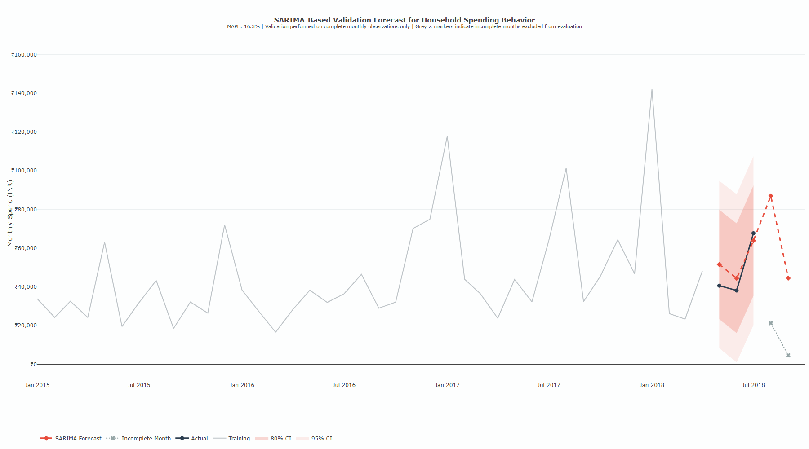
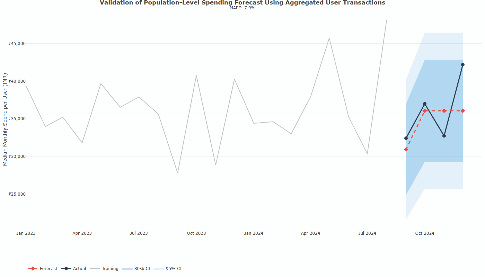
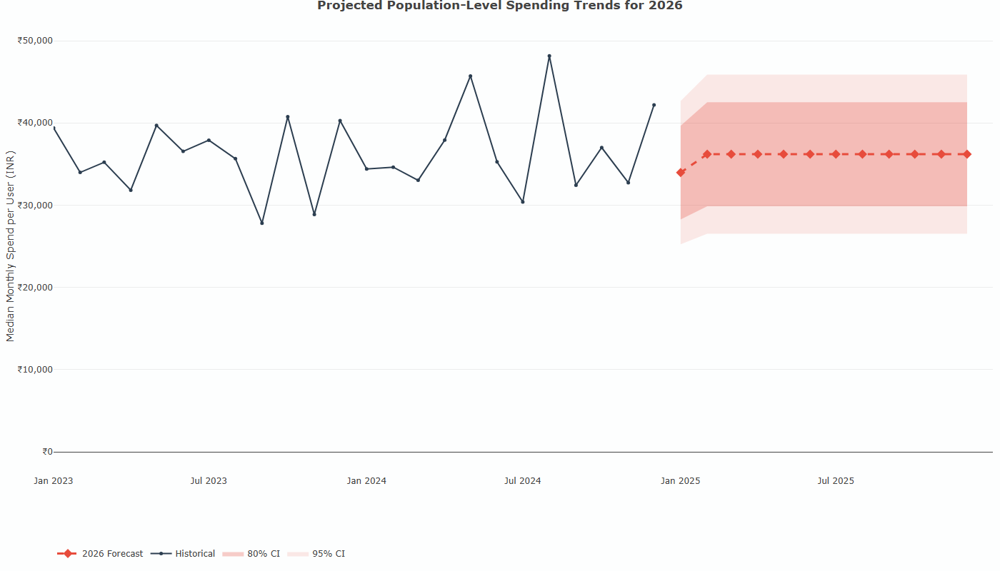

# Multi-Pillar FinTech Behavioral Analytics

A machine learning and forecasting framework for analyzing consumer expenditure behavior using multi-source financial datasets.

This project combines transaction activity, demographic risk profiles, global spending behavior, and mobile cashflow records to study spending patterns, expenditure variability, and forecasting behavior in FinTech environments.

---

## Project Overview

The framework integrates four financial data pillars:

- Pillar 1 — Household transaction activity
- Pillar 2 — Demographic and financial risk profiles
- Pillar 3 — Global consumer spending behavior
- Pillar 4 — Mobile application cashflow activity

The project applies machine learning and time-series forecasting techniques to analyze:

- expenditure behavior
- spending categories
- overspending tendencies
- household expenditure forecasting
- population-level spending trends

---

## Methods Used

### Machine Learning
- Random Forest
- XGBoost

### Forecasting
- SARIMA time-series forecasting

### Feature Engineering
- transaction intensity
- spending variability
- income impact estimation
- time-based expenditure activity
- intent-group categorization

---

## Model Performance

### Overall Accuracy

| Model | Accuracy |
|---|---|
| Random Forest | 66.63% |
| XGBoost | 66.59% |

### Class-wise F1 Scores

| Class | Random Forest | XGBoost |
|---|---|---|
| Essential | 0.799 | 0.796 |
| Income | 0.302 | 0.278 |
| Lifestyle | 0.710 | 0.697 |
| Other | 0.415 | 0.448 |

---

## Forecasting Results

### Household expenditure validation

### Population-level expenditure validation

### Future expenditure forecast

---

## Technologies Used

- R
- tidyverse
- caret
- randomForest
- xgboost
- forecast
- plotly
- lubridate

---

## Research Focus

This work explores how multi-source financial transaction data can support:

- intelligent financial analytics
- expenditure behavior modeling
- overspending detection
- forecasting of expenditure activity
- personalized financial services

---

## Author

Anvita Manne
